# SPRAL SSIDS Parity Flow

This diagram tracks the Rust SSIDS parity ladder against native SPRAL SSIDS.
Green nodes have active bitwise or exact metadata coverage. Yellow nodes are
newly passing in the current checkpoint. Orange nodes have partial coverage or a
known narrowed boundary. Red nodes are the next open bitwise mismatch target.

Current newly passing witness:
`dense_seed09_first_app_update_and_tail_tpp_match_native_kernels` now also
mirrors `target/native/spral-upstream/src/ssids/cpu/factor.hxx`'s
`factor_node_indef` second-pass TPP call after APP accepts the first block:
`ldlt_tpp_factor(m-nelim, n-nelim, &perm[nelim], &lcol[nelim*(ldl+1)], ldl,
&d[2*nelim], ld, m-nelim, ..., nelim, &lcol[nelim], ldl)`. With the same
post-APP Rust front state, this source-shaped native TPP replay matches Rust
production tail inverse-D storage bitwise. The remaining dense seed09 mismatch
therefore stays above this second-pass TPP call convention.

Previous newly passing witness:
`dense_seed09_case0_production_inverse_d_entries_match_through_pivot38_except_known_gap`
pins SPRAL's `enquire_indef` layout from
`target/native/spral-upstream/src/ssids/cpu/NumericSubtree.hxx`: `d(1,:)`
holds inverse-D diagonal entries and `d(2,:)` holds off-diagonal entries in
pivot order. Dense seed09 production inverse-D has an active guard showing all
components through pivot 38 match bitwise except the known pivot 37 off-diagonal
gap. The next confirmed drift is pivot 39's diagonal component.

Earlier passing witness:
`dense_seed09_first_app_update_and_tail_tpp_match_native_kernels` checked the
seed09 tail with native `ldlt_tpp_factor` embedded at the same offset and
leading dimension it has inside the 55-row APP front. The embedded tail D
entries match the isolated native tail D entries bitwise. The full
native-production inverse-D guard still first differs at flattened index 75, so
the open issue is outside tail-pointer offset and leading-dimension effects.

Earlier storage witness:
`dense_seed09_first_app_update_and_tail_tpp_match_native_kernels` checked that
Rust production inverse-D storage for the dense seed09 tail matched the isolated
TPP tail D entries after converting SPRAL's internal 2x2 marker layout to
enquiry layout.

Earlier APP apply-pivot witness:
`dense_seed09_first_app_update_and_tail_tpp_match_native_kernels` checked the
seed09 first-panel `apply_pivot<OP_N>` output with SPRAL's APP leading
dimension, `lda=align_lda(55)`. The L block handed to the accepted APP update
matched native SPRAL bitwise.

Earlier APP-stride TPP witness:
`dense_seed09_first_app_update_and_tail_tpp_match_native_kernels` checked the
post-APP 23x23 TPP tail with SPRAL's native APP leading dimensions:
`lda=align_lda(55)` for the tail matrix and `ldld=align_lda(32)` for
`ldlt_tpp_factor`'s workspace. The APP-stride tail D entries matched bitwise.

Current open guard witness:
`rust_and_native_spral_dense_seed_09c9134e4eff0004_case0_solution_bits`
still captures the dense APP boundary solve mismatch. The paired manual
inverse-D replay is `dense_seed09_case0_production_inverse_d_matches_native`,
which now first differs at flattened inverse-D index 75, i.e. pivot 37
component 1 in SPRAL's enquiry layout. Pivot 39 component 0 is the next
confirmed diagonal drift after skipping the first off-diagonal gap.

```mermaid
flowchart TD
    A["Input symmetric CSC matrix"] --> B["Analyse structure"]
    B --> B1["Ordering / permutation"]
    B --> B2["Elimination tree"]
    B --> B3["Supernodes / fronts"]

    B1 --> C["Numeric factorization"]
    B2 --> C
    B3 --> C

    C --> D["For each front"]
    D --> E["Assemble dense front from matrix + children"]
    E --> F{"Dense front path"}

    F -->|"APP block path"| G["block_ldlt APP panel"]
    F -->|"TPP / tail path"| H["dense TPP tail factorization"]
    H --> H1["Standalone TPP 4x4 factor state"]
    H1 --> H2["Dyadic TPP full cases 0-15"]
    H2 --> H3["Partial TPP case 7 n=3"]

    G --> G0["Native align_lda panel layout"]
    G0 --> G1["find_maxloc"]
    G1 --> G2{"Pivot choice"}
    G2 -->|"1x1"| G3["swap_cols if needed"]
    G3 --> G4["scale pivot column"]
    G4 --> G5["update_1x1 trailing block"]

    G2 -->|"2x2"| G6["test_2x2"]
    G6 --> G7["swap_cols twice"]
    G7 --> G8["compute 2x2 inverse / multipliers"]
    G8 --> G8c["block_ldlt optimized 2x2 first-row multiplier contraction"]
    G8c --> G8d["block_ldlt optimized 2x2 second-row multiplier contraction"]
    G8d --> G8a["calcLD OP_N 2x2 vector row"]
    G8a --> G8b["calcLD OP_N vector/scalar row split"]
    G8b --> G9a["update_2x2 product-sum contraction"]
    G9a --> G9["update_2x2 trailing block"]

    G2 -->|"failed / delayed"| G10["delay pivot to parent front"]

    G5 --> I0["Dense seed09 APP-stride apply_pivot OP_N L block"]
    G9 --> I0
    I0 --> I["APP accepted-prefix update"]
    G10 --> J["Record delayed pivots"]
    H --> I

    I --> I1["Dense seed09 first APP accepted update via calcLD + host_gemm"]
    I1 --> I2["Dense seed09 post-APP 23x23 TPP tail factor"]
    I2 --> I3["Dense seed09 APP-stride 23x23 TPP tail factor"]
    I3 --> K4d
    I --> K["Store L/D blocks, local perms, pivot records"]
    K --> K1["Factor order, inertia, pivot stats"]
    K --> K2["Seed6 APP prefix inverse-D bits through 29"]
    K2 --> K3["Seed6 full inverse-D bits"]
    K --> K4a["Dense APP case0 prefix inverse-D bits through 74"]
    K4a --> K4e["Dense seed09 APP-stride apply_pivot OP_N L bits"]
    K4e --> K4c["Dense seed09 isolated APP update + TPP tail kernels"]
    K4c --> K4d["Dense seed09 APP-stride TPP tail D bits"]
    K4d --> K4g["Dense seed09 embedded-offset native TPP tail D bits"]
    K4g --> K4i["Dense seed09 factor_node second-pass TPP tail D bits"]
    K4i --> K4f["Dense seed09 Rust production tail D storage"]
    K4f --> K4h["Dense seed09 post-gap pivot38 inverse-D bits"]
    K4h --> K4b["Dense APP case0 full inverse-D bits"]
    K4b --> K4["Dense APP boundary case0 solution bits"]
    J --> K
    K1 --> L{"More fronts?"}
    K3 --> L
    K4 --> L
    L -->|"yes"| D
    L -->|"no"| M["Report inertia + pivot stats"]

    M --> N["Solve phase"]
    N --> O["Forward triangular solve"]
    O --> P["Block diagonal solve"]
    P --> Q["Backward triangular solve"]
    Q --> R["Solution bit patterns"]

    classDef match fill:#dff7df,stroke:#2f8f46,color:#102615,stroke-width:2px;
    classDef newly fill:#fff4b8,stroke:#b88a00,color:#2a2100,stroke-width:3px;
    classDef partial fill:#ffe3bf,stroke:#b76d12,color:#2b1800,stroke-width:2px;
    classDef open fill:#ffd8d8,stroke:#b43b3b,color:#2b0d0d,stroke-width:2px;

    class A,B,B1,B2,B3,G0,G1,G3,G5,G6,G8,G8a,G8b,G9,H1,H2,H3,K1,M,O,P,Q,R match;
    class K4i newly;
    class C,D,E,F,G,G2,G4,G7,G10,H,I,J,K,L,N partial;
    class G8c,G8d,G9a,I0,I1,I2,I3,K2,K3,K4a,K4c,K4d,K4e,K4f,K4g,K4h match;
    class K4b,K4 open;
```

