# SPRAL SSIDS Parity Flow

This diagram tracks the Rust SSIDS parity ladder against native SPRAL SSIDS.
Green nodes have active bitwise or exact metadata coverage. Yellow nodes are
newly passing bitwise or exact metadata coverage in the current checkpoint.
Orange nodes have partial coverage or a known narrowed boundary. Gold-orange
nodes are newly passing guards that narrow an open mismatch without proving full
bitwise parity. Red nodes are the next open bitwise mismatch target.

Current rejected APP signed-zero hypotheses:
The deterministic signed-zero boundary is inside SPRAL's BLAS-backed
`host_trsm(SIDE_RIGHT, FILL_MODE_LWR, OP_T, DIAG_UNIT)` call rather than the
later APP threshold or accepted-update path. Several tempting scalar rewrites
were tested and rejected because they only moved the first mismatch to another
signed-zero witness:

- A right-to-left source-shaped triangular solve moved a nonzero entry first
  (`0xbffedbb32ab866e0`, index 25), so the current Rust forward in-block order
  is closer to the OpenBLAS path.
- Preserving the previous target zero sign fixes `0xbffedbb32ab866e0` but fails
  at `0x3c2fddd05272d936`, index 64.
- Using the last exact-zero update sign fixes those two cases but fails at
  `0x81baf41f636557c1`, index 56.
- Skipping all zero source values fixes the first two cases but fails at
  `0x7e61757756000303`, index 118.
- Skipping only negative-zero source values fixes the first two cases but fails
  at `0xaed55ad4b5afb713`, index 93.
- Splitting the APP triangular solve tail into OpenBLAS RN-style 4/2/1 column
  groups fixed the isolated `host_trsm` and `apply_pivot<OP_N>` signed-zero
  witness and the 4096-case isolated APP property hunt, but regressed six
  full-solver solution-bit witnesses in `cargo test -p spral_ssids --tests`.
  That means the tail split is incomplete without the wider driver/update
  context and is not an acceptable production parity fix yet.

The relevant source anchors are
`target/native/spral-upstream/src/ssids/cpu/kernels/wrappers.cxx` `host_trsm`,
`target/native/spral-upstream/src/ssids/cpu/kernels/ldlt_app.cxx`
`apply_pivot<OP_N>`, and OpenBLAS `driver/level3/trsm_R.c` plus
`kernel/generic/trsm_kernel_RN.c` and `kernel/generic/trsm_ltcopy_4.c`. For
SPRAL's `host_trsm(SIDE_RIGHT, FILL_MODE_LWR, OP_T, DIAG_UNIT)`, OpenBLAS
dispatches to `DTRSM_RTLU`; `driver/level3/trsm_R.c` maps that real,
transposed-lower, right-side case to the RN microkernel. The native parity
preflight records the linked OpenBLAS runtime provenance; the current local
stack reports OpenBLAS `0.3.32 DYNAMIC_ARCH ... neoversen1`, whose arm64
`KERNEL.NEOVERSEN1` selects the generic `trsm_kernel_RN.c` path for double RN
dtrsm.

Current newly passing solve-lane witness:
Rust APP 2x2 first-multiplier arithmetic now mirrors the observed local
`block_ldlt<32>` codegen split: contracted arithmetic for vectorized rows, and
the `block_ldlt.hxx` source-spelled `d11*work[r] + d21*work[BLOCK_SIZE+r]`
for the narrow scalar tail. The second multiplier remains contracted, matching
the local native build. This closes the active dense seed6 full solution
witness and promotes dense seed09 case0 from ignored/manual to active full
solution-bit parity. `cargo test -p spral_ssids --test bitwise_parity` now has
9 active passing solution witnesses and 4 active remaining failures; seed6,
dense seed09 case0, and dense seed1001 all pass. The source anchor is SPRAL
`target/native/spral-upstream/src/ssids/cpu/kernels/block_ldlt.hxx`
`block_ldlt<T, BLOCK_SIZE>`'s 2x2 multiplier loop, reached from
`target/native/spral-upstream/src/ssids/cpu/kernels/ldlt_app.cxx`.

Current remaining seed6 storage boundary:
The seed6 solve now matches bitwise, but isolated final APP block storage is
not fully green. `dense_seed6_app_block_storage_diverges_after_row30_scalar_tail`
shows row 30, col 28 is closed, and the first remaining local block L mismatch
is row 31, col 28: Rust/source-tail `0x3f66e35ec7827340` versus native full
block `0x3f66e35ec782734a`. This keeps block storage colored partial while the
seed6 full solution node is newly green.

Current newly passing seed1001 witness:
`app_block_ldlt_32_prefix_trace_matches_native_dense_seed1001`,
`dense_seed1001_app_block_storage_matches_native`, and
`dense_seed1001_production_inverse_d_matches_native` now assert bitwise equality
through the seed1001 APP prefix trace, final APP block storage, and production
inverse-D. The active full-solution guard
`rust_and_native_spral_match_dense_seed_1001_33x33_solution_bits` now passes.
The closed one-ulp pivot-10 D gap was caused by `block_ldlt<32>` contracting
`test_2x2`'s determinant expression:
`(a11*detscale)*a22 - fabs(a21)`. Rust now mirrors that full-block codegen with
a fused multiply-add in the APP 2x2 inverse path. The source `test_2x2` helper
and the full-block-codegen determinant guard are tracked separately so the
standalone source-function parity guard cannot hide production APP behavior.
The source anchor remains SPRAL
`target/native/spral-upstream/src/ssids/cpu/kernels/block_ldlt.hxx`
`block_ldlt<T, BLOCK_SIZE>` / `test_2x2`, reached from
`target/native/spral-upstream/src/ssids/cpu/kernels/ldlt_app.cxx`.

Previous newly narrowed solve-lane witness:
`dense_seed6_final_app_pivot_source_expression_matches_native_block` now
reconstructs the final seed6 2x2 APP pivot multiplier from the native prefix
snapshot operands at `step=14, from=28`. The FMA-shaped continuation expression
lands on `0xbf816117c4f8272d`, while the source-spelled
`d11*work[r] + d21*work[32+r]` expression lands on `0xbf816117c4f82730`,
matching the full native `block_ldlt<32>` block at row 30, col 28. This
narrows the seed6 row30 storage gap to the full native optimized
`block_ldlt<32>` source expression at the final 2x2 APP pivot. The source
anchor is SPRAL
`target/native/spral-upstream/src/ssids/cpu/kernels/block_ldlt.hxx`
`block_ldlt<T, BLOCK_SIZE>`'s 2x2 multiplier loop, reached from
`target/native/spral-upstream/src/ssids/cpu/kernels/ldlt_app.cxx`.

Previous newly narrowed solve-lane witness:
`dense_seed6_native_block_continuation_diverges_at_l_storage_gap` now re-enters
native `block_ldlt<32>` from seed6 native prefix-trace snapshots. The first
native continuation mismatch is the same L-storage gap as the Rust/native final
block comparison: `step=14, from=28, status=2, next=30`, matrix row 30, col 28,
continued `0xbf816117c4f8272d` versus full native block
`0xbf816117c4f82730`. This pins the seed6 gap to native full-block optimized
continuation state for the final 2x2 APP pivot, not to Rust-only production
solve traversal or native enquiry/D metadata.

Previous newly narrowed solve-lane witness:
`dense_seed6_app_block_storage_diverges_after_matching_prefix_trace` now pins
the dense seed6 solve-lane boundary below factor metadata and APP prefix
tracing. Rust and native `block_ldlt<32>` prefix traces match bitwise with the
native aligned leading dimension `lda=34`, and final APP block permutations and
inverse-D entries also match. The first final L-storage mismatch in native
`block_ldlt<32>` was row 30, col 28: Rust `0xbf816117c4f8272d` versus native
`0xbf816117c4f82730`. That narrowed the then-open full solution-bit mismatch to
native full-block APP L storage or optimized continuation, not the production
solve traversal. The current seed6 full solution guard is closed by the
scalar-tail first-multiplier split. The source anchors are SPRAL
`target/native/spral-upstream/src/ssids/cpu/kernels/ldlt_app.cxx`
`ldlt_app_factor` / `block_ldlt<32>` and the local native trace shim around the
same kernel.

Previous now-closed solve-lane witness:
`dense_seed6_solution_bits_diverge_after_matching_inverse_d` proved that dense
seed6 production factor metadata, factor order, and inverse-D enquiry bits
match native SPRAL before the solve. Rust production forward solve now mirrors
SPRAL's `NumericSubtree.hxx::solve_fwd` traversal: gather front-local RHS, call
the APP forward solve kernel, then scatter the full front-local RHS. Rust
production diagonal/backward solve now mirrors SPRAL's full-solve path through
`fkeep.F90::inner_solve_cpu` and
`NumericSubtree.hxx::solve_diag_bwd_inner<true,true>`: gather front-local RHS,
apply front-local inverse-D blocks, call `ldlt_app_solve_bwd`, then scatter
eliminated rows. At that checkpoint, the same seed6 RHS still had the original
first solution bit mismatch at index 2: Rust `0x3fc000000000002a` versus native
`0x3fc0000000000022`. The current seed6 full solution guard now matches bitwise
after the scalar-tail first-multiplier split. A source-spelled 2x2 diagonal solve
experiment was also rejected: the
local native `ldlt_app_solve_diag` kernel property matches the FMA-shaped Rust
helper, and the source-spelled expression moved seed6's first solution mismatch
earlier to index 0. The source anchors for the next read are SPRAL
`target/native/spral-upstream/src/ssids/cpu/kernels/ldlt_app.cxx`
`ldlt_app_solve_bwd` and the exact local-panel L storage handed to it by
`target/native/spral-upstream/src/ssids/cpu/NumericSubtree.hxx`.

Previous newly narrowed witness:
`app_apply_pivot_and_host_trsm_signed_zero_boundaries_are_complementary` pins a
generic APP kernel signed-zero boundary to one deterministic witness. For seed
`0xbffedbb32ab866e0`, both raw `host_trsm` and full `apply_pivot<OP_N>` first
differ at flattened matrix index 82, with complementary zero signs:
`host_trsm` has Rust `+0.0` and native `-0.0`, while `apply_pivot<OP_N>` has
Rust `-0.0` and native `+0.0`. This is a fail-closed guard for the open
signed-zero mismatch, not bitwise parity.

Previous now-closed witness:
`dense_seed09_first_app_update_and_tail_tpp_match_native_kernels` now compares
native production `enquire_indef` output with the source-shaped native
`factor_node_indef` second-pass TPP replay for the same dense seed09 tail. The
first replay gap at that checkpoint was pivot 37 component 1
(`native_production=0xbf54f6581dd605f2`,
`factor_node_replay=0xbf54f6581dd605fe`). The current dense seed09 production
inverse-D guard now matches native bitwise, so this section is retained as
historical provenance rather than an active red witness. Rust production tail
storage already matched this factor-node replay, so it did not justify a Rust
storage change.
The source anchors are `target/native/spral-upstream/src/ssids/cpu/factor.hxx`
`factor_node_indef` and
`target/native/spral-upstream/src/ssids/cpu/NumericSubtree.hxx` `enquire`.

Previous newly narrowed witness:
`dense_seed09_first_app_update_and_tail_tpp_match_native_kernels` now carries a
hybrid native trace with source-shaped 2x2 multipliers but the FMA-shaped
`update_2x2` path. That hybrid still diverges from native `block_ldlt<32>` at
the same first-step boundary as the full source-shaped trace: inverse-D index 7
(`trace=0xbf2b4429642a1ee2`, `block_ldlt=0xbf2b4429642a1ee4`) and matrix row
2, col 0 (`trace=0x3f79e327dcf67cce`,
`block_ldlt=0x3f79e327dcf67ccf`). So the pivot-19 source-expression match is
local evidence, not justification for a global APP multiplier expression swap.

Earlier newly narrowed witness:
`dense_seed09_first_app_update_and_tail_tpp_match_native_kernels` now pins the
row 30, col 19 native-wrapper bit to the source-shaped first-row 2x2 multiplier
expression at pivot 19. For the snapshot row 31 operands, the explicit FMA
form gives `0xbf8cbfa8da674b6b`, while the source expression
`d11*work + d21*work2` gives `0xbf8cbfa8da674b6c`, matching native
`block_ldlt<32>` final storage. This explains the one-ulp wrapper bit at this
boundary without invoking a trailing `update_2x2` entry.

Previous newly passing metadata witness:
`dense_seed09_first_app_update_and_tail_tpp_match_native_kernels` now also
maps the FMA continuation row 30, col 19 matrix gap back through APP-local
permutations. Final row 30 maps to snapshot row 31 at the `from=19, status=2,
next=21` 2x2 pivot. Reconstructing the first-row multiplier from that
snapshot's stored inverse-D and `ldwork` operands gives the trace bit pattern
`0xbf8cbfa8da674b6b`, while native `block_ldlt<32>` final storage still has
`0xbf8cbfa8da674b6c`. This pins the one-ulp gap to the optimized 2x2 first-row
multiplier trajectory plus later APP-local row permutation, not a trailing
`update_2x2` entry.

Previous newly passing metadata witness:
`dense_seed09_first_app_update_and_tail_tpp_match_native_kernels` now reports
continuation mismatches with the full APP prefix snapshot pivot metadata. The
source-plain continuation boundary is pinned to `step=0, from=0, status=2,
next=2`, and the FMA-shaped continuation boundary is pinned to `step=10,
from=19, status=2, next=21`. This does not prove a new numeric node green, but
it makes future movement in the APP pivot trajectory fail at the exact pivot
transition instead of only at a final matrix/D entry.

Previous newly narrowed witness:
`dense_seed09_first_app_update_and_tail_tpp_match_native_kernels` now re-enters
native `block_ldlt<32>` from recorded APP prefix-trace snapshots. The source
and FMA trace variants are compile-time specializations, so this no longer
depends on a runtime branch inside the diagnostic shim. The source-plain trace
is already off the native wrapper trajectory after its first 2x2 step:
continuing from snapshot step 0, next 2 first differs in inverse-D at index 7
(`continued=0xbf2b4429642a1ee2`, `block_ldlt=0xbf2b4429642a1ee4`). The
FMA-shaped trace can continue to the wrapper through the earlier snapshots and
first fails only at snapshot step 10, next 21, with the known matrix row 30,
col 19 one-ulp gap (`continued=0xbf8cbfa8da674b6b`,
`block_ldlt=0xbf8cbfa8da674b6c`). That keeps the exact wrapper boundary inside
the optimized 2x2 APP arithmetic trajectory rather than the later TPP tail.

Previous newly narrowed witness:
`dense_seed09_first_app_update_and_tail_tpp_match_native_kernels` now carries a
second native prefix trace that mirrors `target/native/spral-upstream/src/ssids/cpu/kernels/block_ldlt.hxx`
more literally for the 2x2 multiplier and update expressions. That
source-plain trace does not explain the final wrapper result: it first differs
from native `block_ldlt<32>` in inverse-D at index 7
(`trace=0xbf2b4429642a1ee2`, `block_ldlt=0xbf2b4429642a1ee4`) and in the matrix
at row 2, col 0 (`trace=0x3f79e327dcf67cce`,
`block_ldlt=0x3f79e327dcf67ccf`). The actual local wrapper therefore still sits
between the FMA-shaped trace and the source-plain trace, not cleanly at either
extreme.

Previous newly narrowed witness:
`dense_seed09_first_app_update_and_tail_tpp_match_native_kernels` now pins that
the native prefix-trace shim and the native `block_ldlt<32>` wrapper agree on
the first APP block permutation, local permutation, and inverse-D storage, but
their final 32x32 APP block matrix first differs at row 30, col 19:
`trace=0xbf8cbfa8da674b6b`, `block_ldlt=0xbf8cbfa8da674b6c`. The row 30, col
19 source-shaped diagonal gap is therefore inside the native APP block matrix
storage path rather than native permutation or D metadata.

Previous newly passing metadata witness:
The same deterministic guard also pins the trace-vs-wrapper permutation, local
permutation, and inverse-D entries as exact matches before the matrix gap.

Previous newly passing witness:
`dense_seed09_first_app_update_and_tail_tpp_match_native_kernels` now pins that
Rust's production-stride first APP diagonal block and Rust's native-aligned
first APP prefix trace match bitwise. The known row 30, col 19 diagonal gap is
therefore not caused by Rust's dense front using stride 55 while native
`block_ldlt<32>` uses `align_lda(55)`. It sits between Rust/prefix-trace APP
storage and the final native `block_ldlt<32>` wrapper result.

Previous now-closed witness:
`dense_seed09_first_app_update_and_tail_tpp_match_native_kernels` now pins an
earlier source-shaped first APP boundary: the trailing pre-apply operand rows
match bitwise, but the diagonal block read by SPRAL's BLAS-backed
`target/native/spral-upstream/src/ssids/cpu/kernels/wrappers.cxx`
`host_trsm(... SIDE_RIGHT, FILL_MODE_LWR, OP_T, DIAG_UNIT ...)` previously
first differed at row 30, col 19: `rust=0xbf8cbfa8da674b6b`,
`native=0xbf8cbfa8da674b6c`. The downstream host-trsm output then first differed
at row 47, col 30: `rust=0xc0091687167b6783`,
`native=0xc0091687167b6782`. The current source-shaped host-trsm and post-apply
operand guards now match; the remaining historical source-shaped diagnostic
boundary is row 30, col 28.

Previous now-closed witness:
`dense_seed09_first_app_update_and_tail_tpp_match_native_kernels` now pins the
dense seed09 source-shaped first APP pre-apply operand layout. After native
`block_ldlt<32>` and the source-shaped local column permutation, the trailing
operand handed to `target/native/spral-upstream/src/ssids/cpu/kernels/ldlt_app.cxx`
`apply_pivot<OP_N>` matches Rust's pre-apply operand bitwise. The previous row
47, col 30 one-ulp drift is now closed by the scalar-tail multiplier change.

Previous now-closed seed09 witness:
`dense_seed09_first_app_update_and_tail_tpp_match_native_kernels` originally
kept dense seed09 case0 narrowed around the first APP accepted update and the
post-APP TPP tail. After the scalar-tail multiplier change, the source-shaped
`host_trsm` operand guard, the source-shaped post-apply operand guard, and the
native production-vs-`factor_node_indef` TPP replay all match. The remaining
source-shaped diagnostic boundary is the first APP diagonal operand at row 30,
col 28: Rust `0xbf74d4f050074250` versus native `0xbf74d4f05007424d`. This is
historical diagnostic context, not the current dense seed09 inverse-D state.

Current newly passing seed09 inverse-D witnesses:
`dense_seed09_case0_production_inverse_d_matches_native`,
`dense_seed09_case0_production_inverse_d_entries_match_native`, and
`dense_seed09_case0_production_inverse_d_mismatches_are_nonzero_numeric_components`
now assert full production inverse-D bit equality and an empty mismatch map for
dense seed09 case0. The structural-zero guard remains active and green, so the
former pivot 37 component 1 and pivot 39 component 0 inverse-D gaps are closed.
The source anchor for enquiry layout remains
`target/native/spral-upstream/src/ssids/cpu/NumericSubtree.hxx`:
`d(1,:)` holds inverse-D diagonal entries and `d(2,:)` holds off-diagonal
entries in pivot order.

Current newly passing seed09 solution witness:
`rust_and_native_spral_match_dense_seed_09c9134e4eff0004_case0_solution_bits`
is promoted from ignored/manual to an active full-solution bitwise guard. It
passes together with the full dense seed09 inverse-D guard, so dense seed09
case0 no longer represents the open APP boundary solve mismatch.

Current open guard witnesses:
The remaining active full-solution parity failures are
`rust_and_native_spral_match_app_blocked_update_65x65_solution_bits`,
`rust_and_native_spral_match_app_width_one_update_96x96_solution_bits`,
`rust_and_native_spral_match_app_prefix_dtrsv_97x97_solution_bits`, and
`rust_and_native_spral_match_dense_seed_706172697479_case58_solution_bits`.
These keep the production solution-bit node red while the seed6, dense seed09
case0, and dense seed1001 solution witnesses are newly green.

```mermaid
flowchart TD
    A["Input symmetric CSC matrix"] --> B["Analyse structure"]
    B --> B1["Ordering / permutation"]
    B --> B2["Elimination tree"]
    B --> B3["Supernodes / fronts"]

    B1 --> C["Numeric factorization"]
    B2 --> C
    B3 --> C

    C --> D["For each front"]
    D --> E["Assemble dense front from matrix + children"]
    E --> F{"Dense front path"}

    F -->|"APP block path"| G["block_ldlt APP panel"]
    F -->|"TPP / tail path"| H["dense TPP tail factorization"]
    H --> H1["Standalone TPP 4x4 factor state"]
    H1 --> H2["Dyadic TPP full cases 0-15"]
    H2 --> H3["Partial TPP case 7 n=3"]

    G --> G0["Native align_lda panel layout"]
    G0 --> G1["find_maxloc"]
    G1 --> G2{"Pivot choice"}
    G2 -->|"1x1"| G3["swap_cols if needed"]
    G3 --> G4["scale pivot column"]
    G4 --> G5["update_1x1 trailing block"]

    G2 -->|"2x2"| G6["test_2x2"]
    G6 --> G6a["block_ldlt APP determinant contraction"]
    G6a --> G7["swap_cols twice"]
    G7 --> G8["compute 2x2 inverse / multipliers"]
    G8 --> G8c["block_ldlt 2x2 first multiplier vector/scalar split"]
    G8c --> G8d["block_ldlt optimized 2x2 second multiplier contraction"]
    G8d --> G8a["calcLD OP_N 2x2 vector row"]
    G8a --> G8b["calcLD OP_N vector/scalar row split"]
    G8b --> G9a["update_2x2 product-sum contraction"]
    G9a --> G9["update_2x2 trailing block"]

    G2 -->|"failed / delayed"| G10["delay pivot to parent front"]

    G5 --> I00["Dense seed09 first APP block_ldlt trace"]
    G9 --> I00
    I00 --> I0["Dense seed09 APP-stride apply_pivot OP_N L block"]
    I0 --> I0z["APP host_trsm/apply_pivot signed-zero boundary"]
    I0z --> I0zz["OpenBLAS dtrsm OLTCOPY/generic RN zero-sign policy"]
    I0zz --> I0a["Dense seed09 APP check_threshold OP_N pass count"]
    I0a --> I0p["Dense seed09 source-shaped APP pre-apply trailing operands"]
    I0p --> I0r["Dense seed09 production-vs-aligned Rust APP diagonal block"]
    I0r --> I0s["Dense seed09 source-plain native trace D/matrix gap"]
    I0s --> I0u["Dense seed09 source-multiplier FMA-update first-step D gap"]
    I0u --> I0q["Dense seed09 source-plain continuation first-step D gap"]
    I0q --> I0n["Dense seed09 FMA native trace-vs-wrapper APP permutation and D"]
    I0n --> I0m["Dense seed09 continuation pivot metadata"]
    I0m --> I0x["Dense seed09 FMA pivot19 multiplier source row31"]
    I0x --> I0y["Dense seed09 pivot19 source expression matches wrapper bit"]
    I0y --> I0c["Dense seed09 FMA continuation to row30/col19 matrix gap"]
    I0c --> I0d["Dense seed09 FMA native trace-vs-wrapper APP matrix gap"]
    I0d --> I0t["Dense seed09 source-shaped APP host_trsm operands"]
    I0t --> I0b["Dense seed09 source-shaped APP post-apply operands"]
    I0b --> I["APP accepted-prefix update"]
    G10 --> J["Record delayed pivots"]
    H --> I

    I --> I1["Dense seed09 first APP accepted update via calcLD + host_gemm"]
    I1 --> I2["Dense seed09 post-APP 23x23 TPP tail factor"]
    I2 --> I3["Dense seed09 APP-stride 23x23 TPP tail factor"]
    I3 --> K4d
    I --> K["Store L/D blocks, local perms, pivot records"]
    K --> K1["Factor order, inertia, pivot stats"]
    K --> K2["Seed6 APP prefix inverse-D bits through 29"]
    K2 --> K3["Seed6 full inverse-D bits"]
    K3 --> K3b["Seed6 APP row30 L bit closes; row31 storage remains"]
    K3b --> K3c["Seed6 all-FMA continuation reproduces old row30 gap"]
    K3c --> K3d["Seed6 scalar-tail first multiplier closes solution bits"]
    K3d --> K3a["Seed6 full solution bits"]
    K --> K4a["Dense APP case0 prefix inverse-D bits through 74"]
    K4a --> K4e["Dense seed09 APP-stride apply_pivot OP_N L bits"]
    K4e --> K4c["Dense seed09 isolated APP update + TPP tail kernels"]
    K4c --> K4d["Dense seed09 APP-stride TPP tail D bits"]
    K4d --> K4g["Dense seed09 embedded-offset native TPP tail D bits"]
    K4g --> K4i["Dense seed09 factor_node second-pass TPP tail D bits"]
    K4i --> K4l["Dense seed09 native production vs factor_node replay D bits"]
    K4l --> K4f["Dense seed09 Rust production tail D storage"]
    K4f --> K4h["Dense seed09 post-gap pivot38 inverse-D bits"]
    K4h --> K4j["Dense seed09 inverse-D structural zero bits"]
    K4j --> K4k["Dense seed09 inverse-D mismatch map is empty"]
    K4k --> K4b["Dense APP case0 full inverse-D bits"]
    K4b --> K4["Dense APP boundary case0 solution bits"]
    K --> K5a["Dense seed1001 APP prefix trace bits"]
    K5a --> K5b["Dense seed1001 APP block storage bits"]
    K5b --> K5c["Dense seed1001 production inverse-D bits"]
    K5c --> K5["Dense seed1001 solution bits"]
    J --> K
    K1 --> L{"More fronts?"}
    K3 --> L
    K4 --> L
    K5 --> L
    L -->|"yes"| D
    L -->|"no"| M["Report inertia + pivot stats"]

    M --> N["Solve phase"]
    N --> O0["Production forward traversal uses NumericSubtree front panels"]
    O0 --> O["Forward triangular solve"]
    O --> O1["Production diag+bwd traversal uses NumericSubtree combined path"]
    O1 --> P["Block diagonal solve"]
    O1 --> Q["Backward triangular solve"]
    Q --> R["Individual solve kernel bit patterns"]
    P --> R
    R --> S["Full production solution bit patterns"]
    K3a --> S
    K5 --> S

    classDef match fill:#dff7df,stroke:#2f8f46,color:#102615,stroke-width:2px;
    classDef newly fill:#fff4b8,stroke:#b88a00,color:#2a2100,stroke-width:3px;
    classDef newlyPartial fill:#ffd89c,stroke:#b88a00,color:#2b1800,stroke-width:3px;
    classDef partial fill:#ffe3bf,stroke:#b76d12,color:#2b1800,stroke-width:2px;
    classDef open fill:#ffd8d8,stroke:#b43b3b,color:#2b0d0d,stroke-width:2px;

    class A,B,B1,B2,B3,G0,G1,G3,G5,G6,G8,G8a,G8b,G9,H1,H2,H3,K1,M,O,P,Q,R match;
    class I0p,I0r match;
    class I0s partial;
    class I0m newly;
    class I0u newlyPartial;
    class I0x,I0y newlyPartial;
    class I0q,I0c newlyPartial;
    class I0n match;
    class I0d partial;
    class I0z newlyPartial;
    class I0zz open;
    class I0t,I0b newly;
    class K4j match;
    class K4k newly;
    class C,D,E,F,G,G2,G4,G7,G10,H,I,J,K,L,N partial;
    class O0,O1 newlyPartial;
    class K3b,K3c newlyPartial;
    class K3a,K3d newly;
    class K4l newly;
    class G6a,K5a,K5b,K5c,K5 newly;
    class G8c,G8d,G9a,I00,I0,I0a,I1,I2,I3,K2,K3,K4a,K4c,K4d,K4e,K4f,K4g,K4h,K4i match;
    class K4b,K4 newly;
    class S open;
```

