# SPRAL SSIDS Parity Flow

This diagram tracks the Rust SSIDS parity ladder against native SPRAL SSIDS.
Green nodes have active bitwise or exact metadata coverage. Yellow nodes are
newly passing bitwise or exact metadata coverage in the current checkpoint.
Orange nodes have partial coverage or a known narrowed boundary. Gold-orange
nodes are newly passing guards that narrow an open mismatch without proving full
bitwise parity. Red nodes are the next open bitwise mismatch target.

Current newly narrowed witness:
`dense_seed09_first_app_update_and_tail_tpp_match_native_kernels` now pins that
the native prefix-trace shim and the native `block_ldlt<32>` wrapper agree on
the first APP block permutation, local permutation, and inverse-D storage, but
their final 32x32 APP block matrix first differs at row 30, col 19:
`trace=0xbf8cbfa8da674b6b`, `block_ldlt=0xbf8cbfa8da674b6c`. The row 30, col
19 source-shaped diagonal gap is therefore inside the native APP block matrix
storage path rather than native permutation or D metadata.

Current newly passing metadata witness:
The same deterministic guard also pins the trace-vs-wrapper permutation, local
permutation, and inverse-D entries as exact matches before the matrix gap.

Previous newly passing witness:
`dense_seed09_first_app_update_and_tail_tpp_match_native_kernels` now pins that
Rust's production-stride first APP diagonal block and Rust's native-aligned
first APP prefix trace match bitwise. The known row 30, col 19 diagonal gap is
therefore not caused by Rust's dense front using stride 55 while native
`block_ldlt<32>` uses `align_lda(55)`. It sits between Rust/prefix-trace APP
storage and the final native `block_ldlt<32>` wrapper result.

Previous newly narrowed witness:
`dense_seed09_first_app_update_and_tail_tpp_match_native_kernels` now pins an
earlier source-shaped first APP boundary: the trailing pre-apply operand rows
match bitwise, but the diagonal block read by SPRAL's BLAS-backed
`target/native/spral-upstream/src/ssids/cpu/kernels/wrappers.cxx`
`host_trsm(... SIDE_RIGHT, FILL_MODE_LWR, OP_T, DIAG_UNIT ...)` first differs at
row 30, col 19: `rust=0xbf8cbfa8da674b6b`,
`native=0xbf8cbfa8da674b6c`. The downstream host-trsm output then first differs
at row 47, col 30: `rust=0xc0091687167b6783`,
`native=0xc0091687167b6782`. This is not a green bitwise parity node; it moves
the source-shaped APP drift above the trailing operand permutation and into the
diagonal block storage handed to the BLAS triangular solve.

Previous newly passing witness:
`dense_seed09_first_app_update_and_tail_tpp_match_native_kernels` now pins the
dense seed09 source-shaped first APP pre-apply operand layout. After native
`block_ldlt<32>` and the source-shaped local column permutation, the trailing
operand handed to `target/native/spral-upstream/src/ssids/cpu/kernels/ldlt_app.cxx`
`apply_pivot<OP_N>` matches Rust's pre-apply operand bitwise. The remaining
row 47, col 30 one-ulp drift is therefore introduced by the source-shaped
`apply_pivot<OP_N>` replay or immediately after it, not by the column
permutation into the first APP trailing block.

Previous newly narrowed witness:
`dense_seed09_first_app_update_and_tail_tpp_match_native_kernels` now pins the
first dense seed09 source-shaped APP operand drift after native
`block_ldlt<32>`, source-shaped column permutation, native `apply_pivot<OP_N>`,
and source-shaped `check_threshold<OP_N>`. The first mismatch against Rust's
production first APP operand is row 47, col 30:
`rust=0xbfd76be586dab26a`, `native=0xbfd76be586dab269`. This is not a green
bitwise parity node; it narrows the remaining full inverse-D failure to the
first APP operand handed to the accepted update.

Previous newly passing witness:
`dense_seed09_first_app_update_and_tail_tpp_match_native_kernels` now pins the
dense seed09 first APP a-posteriori threshold boundary against
`target/native/spral-upstream/src/ssids/cpu/kernels/ldlt_app.cxx`'s
`check_threshold<OP_N>` loop. After the bitwise-matching `apply_pivot<OP_N>`
result, Rust and the source-shaped C++ shim agree on the accepted pass count,
so the first APP block is not drifting through threshold-boundary selection.

Previous newly passing witness:
`app_block_ldlt_32_aligned_prefix_trace_matches_native_dense_seed09_case0`
pins the dense seed09 first APP diagonal block against native
`target/native/spral-upstream/src/ssids/cpu/kernels/block_ldlt.hxx` at the
same aligned leading dimension used by the full 55-row front. The per-pivot
trace covers factor status, next pivot, global/local permutations, lower block
storage, `ldwork`, and inverse-D storage bitwise. The remaining red dense
seed09 inverse-D drift is therefore not caused by the first APP block's
`block_ldlt<32>` prefix.

Previous newly narrowed witness:
`dense_seed09_case0_production_inverse_d_mismatches_are_nonzero_numeric_components`
keeps the full dense seed09 production inverse-D mismatch pinned to nonzero
numeric D components. The first mismatch remains pivot 37 component 1 with
`rust=0xbf54f6581dd605fe` and `native=0xbf54f6581dd605f2`, and every mismatch
is nonzero on both Rust and native sides. This does not turn the full inverse-D
node green; it rules out another signed-zero or structural-layout explanation
for the remaining red witness.

Earlier newly passing witness:
`dense_seed09_case0_production_inverse_d_structural_zero_components_match_native`
pins the full dense seed09 production inverse-D enquiry layout for structural
zero off-diagonal components. Every Rust entry whose `d(2,:)` component is the
SPRAL enquiry structural `+0.0` has the same native structural-zero status and
the same `+0.0` bit pattern. This keeps the remaining full inverse-D mismatch
focused on nonzero numeric D entries, not block-layout or signed-zero drift.

Earlier newly passing witness:
`dense_seed09_first_app_update_and_tail_tpp_match_native_kernels` now also
mirrors `target/native/spral-upstream/src/ssids/cpu/factor.hxx`'s
`factor_node_indef` second-pass TPP call after APP accepts the first block:
`ldlt_tpp_factor(m-nelim, n-nelim, &perm[nelim], &lcol[nelim*(ldl+1)], ldl,
&d[2*nelim], ld, m-nelim, ..., nelim, &lcol[nelim], ldl)`. With the same
post-APP Rust front state, this source-shaped native TPP replay matches Rust
production tail inverse-D storage bitwise. The remaining dense seed09 mismatch
therefore stays above this second-pass TPP call convention.

Earlier post-gap witness:
`dense_seed09_case0_production_inverse_d_entries_match_through_pivot38_except_known_gap`
pins SPRAL's `enquire_indef` layout from
`target/native/spral-upstream/src/ssids/cpu/NumericSubtree.hxx`: `d(1,:)`
holds inverse-D diagonal entries and `d(2,:)` holds off-diagonal entries in
pivot order. Dense seed09 production inverse-D has an active guard showing all
components through pivot 38 match bitwise except the known pivot 37 off-diagonal
gap. The next confirmed drift is pivot 39's diagonal component.

Earlier passing witness:
`dense_seed09_first_app_update_and_tail_tpp_match_native_kernels` checked the
seed09 tail with native `ldlt_tpp_factor` embedded at the same offset and
leading dimension it has inside the 55-row APP front. The embedded tail D
entries match the isolated native tail D entries bitwise. The full
native-production inverse-D guard still first differs at flattened index 75, so
the open issue is outside tail-pointer offset and leading-dimension effects.

Earlier storage witness:
`dense_seed09_first_app_update_and_tail_tpp_match_native_kernels` checked that
Rust production inverse-D storage for the dense seed09 tail matched the isolated
TPP tail D entries after converting SPRAL's internal 2x2 marker layout to
enquiry layout.

Earlier APP apply-pivot witness:
`dense_seed09_first_app_update_and_tail_tpp_match_native_kernels` checked the
seed09 first-panel `apply_pivot<OP_N>` output with SPRAL's APP leading
dimension, `lda=align_lda(55)`. The L block handed to the accepted APP update
matched native SPRAL bitwise.

Earlier APP-stride TPP witness:
`dense_seed09_first_app_update_and_tail_tpp_match_native_kernels` checked the
post-APP 23x23 TPP tail with SPRAL's native APP leading dimensions:
`lda=align_lda(55)` for the tail matrix and `ldld=align_lda(32)` for
`ldlt_tpp_factor`'s workspace. The APP-stride tail D entries matched bitwise.

Current open guard witness:
`rust_and_native_spral_dense_seed_09c9134e4eff0004_case0_solution_bits`
still captures the dense APP boundary solve mismatch. The paired manual
inverse-D replay is `dense_seed09_case0_production_inverse_d_matches_native`,
which now first differs at flattened inverse-D index 75, i.e. pivot 37
component 1 in SPRAL's enquiry layout. Pivot 39 component 0 is the next
confirmed diagonal drift after skipping the first off-diagonal gap.

```mermaid
flowchart TD
    A["Input symmetric CSC matrix"] --> B["Analyse structure"]
    B --> B1["Ordering / permutation"]
    B --> B2["Elimination tree"]
    B --> B3["Supernodes / fronts"]

    B1 --> C["Numeric factorization"]
    B2 --> C
    B3 --> C

    C --> D["For each front"]
    D --> E["Assemble dense front from matrix + children"]
    E --> F{"Dense front path"}

    F -->|"APP block path"| G["block_ldlt APP panel"]
    F -->|"TPP / tail path"| H["dense TPP tail factorization"]
    H --> H1["Standalone TPP 4x4 factor state"]
    H1 --> H2["Dyadic TPP full cases 0-15"]
    H2 --> H3["Partial TPP case 7 n=3"]

    G --> G0["Native align_lda panel layout"]
    G0 --> G1["find_maxloc"]
    G1 --> G2{"Pivot choice"}
    G2 -->|"1x1"| G3["swap_cols if needed"]
    G3 --> G4["scale pivot column"]
    G4 --> G5["update_1x1 trailing block"]

    G2 -->|"2x2"| G6["test_2x2"]
    G6 --> G7["swap_cols twice"]
    G7 --> G8["compute 2x2 inverse / multipliers"]
    G8 --> G8c["block_ldlt optimized 2x2 first-row multiplier contraction"]
    G8c --> G8d["block_ldlt optimized 2x2 second-row multiplier contraction"]
    G8d --> G8a["calcLD OP_N 2x2 vector row"]
    G8a --> G8b["calcLD OP_N vector/scalar row split"]
    G8b --> G9a["update_2x2 product-sum contraction"]
    G9a --> G9["update_2x2 trailing block"]

    G2 -->|"failed / delayed"| G10["delay pivot to parent front"]

    G5 --> I00["Dense seed09 first APP block_ldlt trace"]
    G9 --> I00
    I00 --> I0["Dense seed09 APP-stride apply_pivot OP_N L block"]
    I0 --> I0a["Dense seed09 APP check_threshold OP_N pass count"]
    I0a --> I0p["Dense seed09 source-shaped APP pre-apply trailing operands"]
    I0p --> I0r["Dense seed09 production-vs-aligned Rust APP diagonal block"]
    I0r --> I0n["Dense seed09 native trace-vs-wrapper APP permutation and D"]
    I0n --> I0d["Dense seed09 native trace-vs-wrapper APP matrix gap"]
    I0d --> I0t["Dense seed09 source-shaped APP host_trsm gap"]
    I0t --> I0b["Dense seed09 source-shaped APP post-apply operand gap"]
    I0b --> I["APP accepted-prefix update"]
    G10 --> J["Record delayed pivots"]
    H --> I

    I --> I1["Dense seed09 first APP accepted update via calcLD + host_gemm"]
    I1 --> I2["Dense seed09 post-APP 23x23 TPP tail factor"]
    I2 --> I3["Dense seed09 APP-stride 23x23 TPP tail factor"]
    I3 --> K4d
    I --> K["Store L/D blocks, local perms, pivot records"]
    K --> K1["Factor order, inertia, pivot stats"]
    K --> K2["Seed6 APP prefix inverse-D bits through 29"]
    K2 --> K3["Seed6 full inverse-D bits"]
    K --> K4a["Dense APP case0 prefix inverse-D bits through 74"]
    K4a --> K4e["Dense seed09 APP-stride apply_pivot OP_N L bits"]
    K4e --> K4c["Dense seed09 isolated APP update + TPP tail kernels"]
    K4c --> K4d["Dense seed09 APP-stride TPP tail D bits"]
    K4d --> K4g["Dense seed09 embedded-offset native TPP tail D bits"]
    K4g --> K4i["Dense seed09 factor_node second-pass TPP tail D bits"]
    K4i --> K4f["Dense seed09 Rust production tail D storage"]
    K4f --> K4h["Dense seed09 post-gap pivot38 inverse-D bits"]
    K4h --> K4j["Dense seed09 inverse-D structural zero bits"]
    K4j --> K4k["Dense seed09 nonzero inverse-D mismatch map"]
    K4k --> K4b["Dense APP case0 full inverse-D bits"]
    K4b --> K4["Dense APP boundary case0 solution bits"]
    J --> K
    K1 --> L{"More fronts?"}
    K3 --> L
    K4 --> L
    L -->|"yes"| D
    L -->|"no"| M["Report inertia + pivot stats"]

    M --> N["Solve phase"]
    N --> O["Forward triangular solve"]
    O --> P["Block diagonal solve"]
    P --> Q["Backward triangular solve"]
    Q --> R["Solution bit patterns"]

    classDef match fill:#dff7df,stroke:#2f8f46,color:#102615,stroke-width:2px;
    classDef newly fill:#fff4b8,stroke:#b88a00,color:#2a2100,stroke-width:3px;
    classDef newlyPartial fill:#ffd89c,stroke:#b88a00,color:#2b1800,stroke-width:3px;
    classDef partial fill:#ffe3bf,stroke:#b76d12,color:#2b1800,stroke-width:2px;
    classDef open fill:#ffd8d8,stroke:#b43b3b,color:#2b0d0d,stroke-width:2px;

    class A,B,B1,B2,B3,G0,G1,G3,G5,G6,G8,G8a,G8b,G9,H1,H2,H3,K1,M,O,P,Q,R match;
    class I0p,I0r match;
    class I0n newly;
    class I0d newlyPartial;
    class I0t,I0b partial;
    class K4j match;
    class K4k partial;
    class C,D,E,F,G,G2,G4,G7,G10,H,I,J,K,L,N partial;
    class G8c,G8d,G9a,I00,I0,I0a,I1,I2,I3,K2,K3,K4a,K4c,K4d,K4e,K4f,K4g,K4h,K4i match;
    class K4b,K4 open;
```

