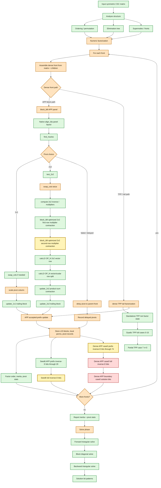

# SPRAL SSIDS Parity Flow

This diagram tracks the Rust SSIDS parity ladder against native SPRAL SSIDS.
Green nodes have active bitwise or exact metadata coverage. Yellow nodes are
newly passing in the current checkpoint. Orange nodes have partial coverage or a
known narrowed boundary. Red nodes are the next open bitwise mismatch target.

Current newly passing witness:
`block_ldlt.hxx`'s 2x2 multiplier rows now mirror the local optimized native
contraction order for both APP multiplier columns. That promotes
`dense_seed6_production_inverse_d_matches_native` to a full active bitwise
inverse-D guard and extends
`dense_seed09_case0_production_app_prefix_inverse_d_matches_native` through
flattened inverse-D index 74. The next open production boundary is dense seed
`0x09c9134e4eff0004` case0 index 75.

Previous newly passing witness:
`block_ldlt.hxx::update_2x2` mirrored the local optimized native two-product
contraction order for the APP trailing update, extending seed6 through
flattened inverse-D index 29 and dense seed09 case0 through index 13.

Current open guard witness:
`rust_and_native_spral_dense_seed_09c9134e4eff0004_case0_solution_bits`
still captures the dense APP boundary solve mismatch. The paired manual
inverse-D replay is `dense_seed09_case0_production_inverse_d_matches_native`,
which now first differs at flattened inverse-D index 75.

